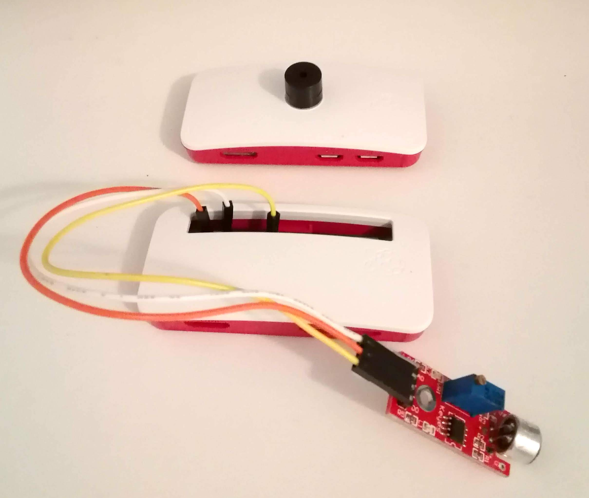

Entrance bell repeater
======================




Buzzer
------

```bash
sudo ln -s $(pwd)/buzzer.service /etc/systemd/system/buzzer.service
sudo systemctl enable buzzer.service
sudo systemctl start buzzer.service
```

Sensor
------

```bash
sudo echo "10.0.1.10" > /boot/buzz-ip.txt
sudo ln -s $(pwd)/sensor.service /etc/systemd/system/sensor.service
sudo systemctl enable sensor.service
sudo systemctl start sensor.service
```

Change WIFI
-----------

Create the file `/boot/wpa_supplicant.conf` and reboot:

```
ctrl_interface=DIR=/var/run/wpa_supplicant GROUP=netdev
update_config=1
network={
  ssid="myssid"
  psk="mypassword"
}
```
